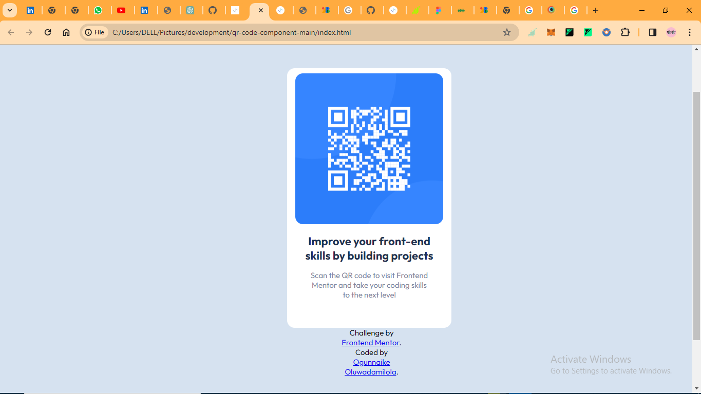

# Frontend Mentor - QR code component solution

This is a solution to the [QR code component challenge on Frontend Mentor](https://www.frontendmentor.io/challenges/qr-code-component-iux_sIO_H). Frontend Mentor challenges help you improve your coding skills by building realistic projects. 

## Table of contents

- [Overview](#overview)
  - [Screenshot](#screenshot)
  - [Links](#links)
- [My process](#my-process)
  - [Built with](#built-with)
  - [What I learned](#what-i-learned)
  - [Continued development](#continued-development)
  - [Useful resources](#useful-resources)
- [Author](#author)
- [Acknowledgments](#acknowledgments)

**Note: Delete this note and update the table of contents based on what sections you keep.**

## Overview

### Screenshot

### Links

- Solution URL: [Add solution URL here](https://your-solution-url.com)
- Live Site URL: [Add live site URL here](https://your-live-site-url.com)

## My process

### Built with

- Semantic HTML5 markup
- CSS custom properties
- Flexbox
- CSS Grid
- Mobile-first workflow

### What I learned
i learnt the difference between border, padding and margin. Also, i was able to have the knowledge of hue, saturation and lue. 

To see how you can add code snippets, see below:
h1{
    font-weight: 700;
    color: hsl(218, 44%, 22%);
    font-size: 22px;
}
p{
    font-weight: 400;
    font-size: 15px;
    color: hsl(220, 15%, 55%);
}
.attribution{
    font-size: 15px;
  text-align: center;
  width: fit-contents;
   justify-content: center;
   margin-left: 100px;
align-self: center;
}

### Continued development

i want to focus more on my kniwlege of using css to design my webpage layout. It's fun to use although confusing sometimes.

### Useful resources

- [Djanjo Bootcamp](#) - This really helped me alot it was a course i coukd fall back to when im confused.

## Author
- Name - [Ogunnaike Oluwadamilola]
- Frontend Mentor - [@yourusername](https://www.frontendmentor.io/profile/yourusername)
- Twitter - [@emeperorustech](https://www.twitter.com/emperorustech)

## Acknowledgments

It was actually seld taught with a lot of tips from youtube video because I'm literally still learning but I'm getting there
